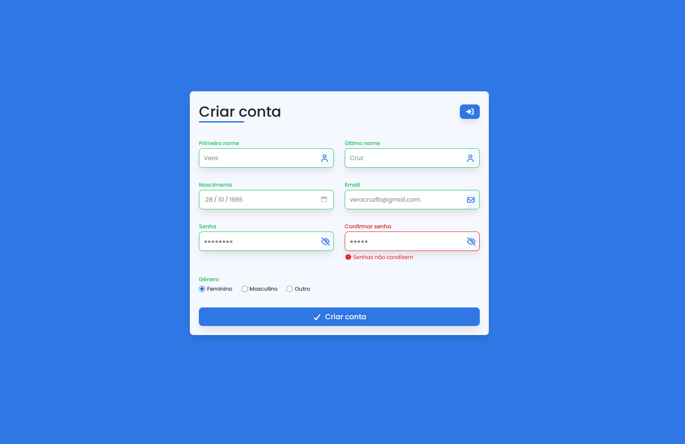

# 📝 Formulário de Criação de Conta

Projeto de um formulário moderno e responsivo para criação de contas, desenvolvido com HTML, CSS e JavaScript.

## 📱 Preview

### 💻 Versão Desktop



### 📲 Versão Mobile


---

## 🚀 Tecnologias utilizadas

- HTML5
- CSS3
- JavaScript
- Font Awesome

---

## 🎯 Funcionalidades

- Alternar visualização de senha 👁️
- Inputs estilizados com ícones
- Layout responsivo (mobile e desktop)
- Validação básica de formulário

---

## 📂 Estrutura do projeto

```
📁 src
 ├── 📁 styles
 ├── 📁 js
📄 index.html
```

---

## 💡 Objetivo

Praticar conceitos de front-end, incluindo:

- Responsividade
- Manipulação do DOM
- Boas práticas de UI/UX

---

## 📌 Como usar

1. Clone o repositório
2. Abra o arquivo `index.html` no navegador

---

## 👨‍💻 Autor

Desenvolvido por [William Henrique](https://github.com/Williamhsf) 🚀
